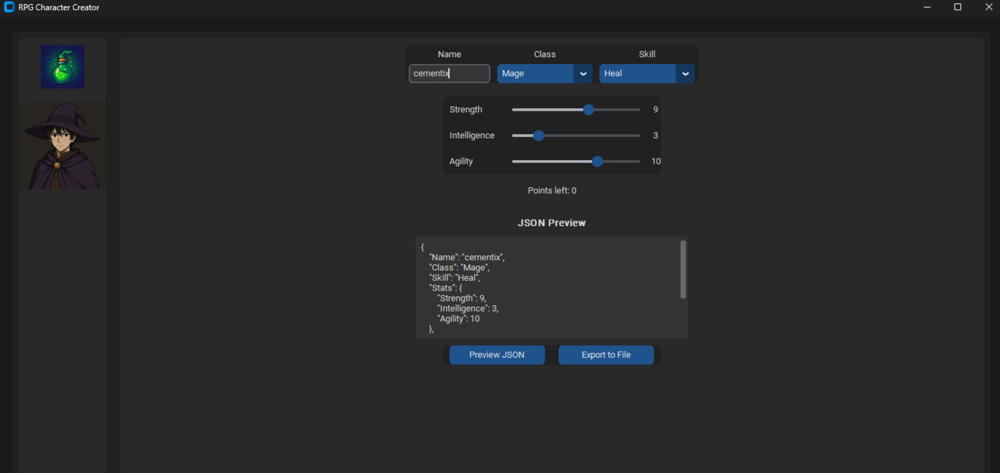
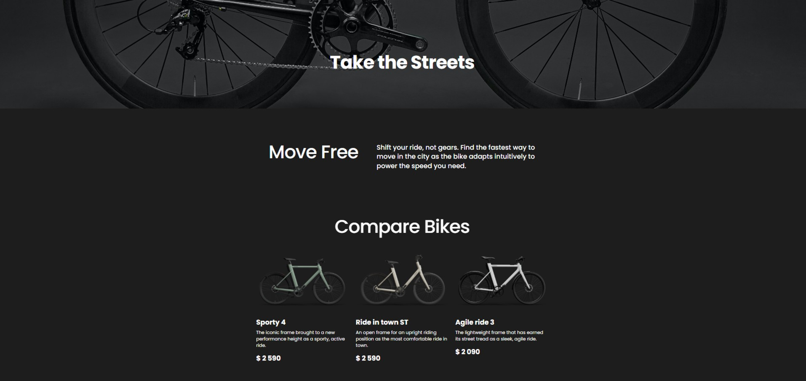

# hi! ♡

## ⛧°.⋆༺ full stack developer · react | next.js | typescript · roblox scripter (lua), builder & animator (blender) ༻⋆.°⛧

  
  &nbsp;&nbsp;&nbsp;

<small>⛧ i’m a full stack developer based in wrocław, poland. i work with react, next.js, typescript, and python — focused on clean ui, precise logic, and scalable structure. ⛧</small>

<small>⋆ i also script in lua and craft interactive systems, animation, and gameplay flow inside roblox. ⋆</small>

## ✃𓄧꒷꒦ my main projects ꒦꒷𓄧✃

  <table>
<tr>
      <td align="center" width="50%">
        <h3>⛧ messenger clone</h3>
        

          <a href="https://github.com/cementix/messenger-clone" target="_blank">repository</a> · 
          <a href="https://messenger-clone-two-weld.vercel.app/" target="_blank">live deployment</a>
        

        

        
a real-time chat built with next.js and typescript.  
        features authentication, notifications, and live message sync via pusher.

        

        
      </td>
      <td align="center" width="50%">
        <h3>⛧ python character creator</h3>
        

          <a href="https://github.com/cementix/py_rpg_char_creator" target="_blank">repository</a>
        

        
minimal python template focused on oop structure and json data export.
built for experimenting with class design, inheritance and ui logic.

        
      </td>
    </tr>
<tr>
      <td align="center" width="50%">
        <h3>⛧ bem-method landing</h3>
        

          <a href="https://github.com/cementix/layout_landing-page" target="_blank">repository</a> · 
          <a href="https://cementix.github.io/layout_landing-page/" target="_blank">live deployment</a>
        

        
responsive html/scss landing built with the bem methodology.
simple, modular, and easy to extend for multi-section layouts.

        
      </td>
    <td align="center" width="50%">
        <h3>⛧ mern food ordering app</h3>
        

          <a href="https://github.com/cementix/mern-food-ordering-app" target="_blank">repository</a> · 
          <a href="https://mern-food-ordering-app-frontend-4cv5.onrender.com/" target="_blank">live deployment</a>
        

        
full-stack food ordering system built with the mern stack and stripe.  
        jwt auth, live order tracking and clean ui.

        
      </td>
    </tr>
  </table>

## ⛧°.⋆༺ skills & stats ༻⋆.°⛧

  <table>
    <tr>
      <td width="55%" valign="top" align="left">
        <h3>core</h3>
        
          
        <h3>tools</h3>
        
          
        <h3>software</h3>
        
      </td>
      <td width="45%" valign="top" align="center">
        
          
        
          
        
      </td>
    </tr>
  </table>

