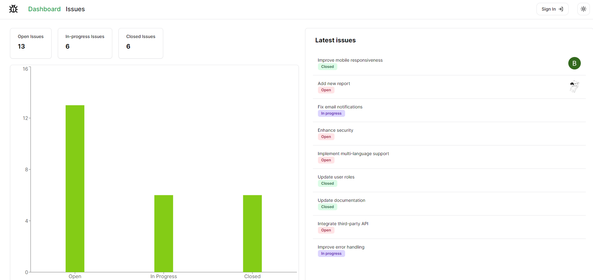

# Hi!👋 My name is Bohdan Kondratsky

## Full Stack Developer (React/Next.js + TypeScript)

 

I'm interested in web development, AI technologies, UX/UI design.

- 🌍  I'm based in Dnipro, Ukraine.
- ✉️  You can contact me at [bodakondrackij@gmail.com](mailto:bodakondrackij@gmail.com)
- 🤝  I'm open to collaborating on commercial, interesting projects with great design.
- 🔮  I'm driven by a strong sense of purpose and ambition, constantly seeking to make a positive impact.
- 📚  I have a deep passion for reading, especially light novels that delve into character development.
- 💪  I maintain a healthy lifestyle by lifting weights and running regularly.
- 🐶  I absolutely adore dogs and sincerely enjoy spending time with them.

## Experience

  <table>
    <tr>
      <td align="center" width="50%">
        <h3>Issue Tracker - Full Stack Project</h3>
       

        
<a href="https://github.com/cementix/issue-tracker" target="_blank">GitHub Repo</a>

        
<a href="https://issue-tracker-rose-psi.vercel.app/" target="_blank">Vercel Deployment</a>

       

        
A comprehensive issue tracking system built with Next.js and TypeScript, featuring user authentication, pagination and filtering issues.

        
      </td>
      <td align="center" width="50%">
        <h3>Messenger Clone - Full Stack Project</h3>
        

        
<a href="https://github.com/cementix/messenger-clone" target="_blank">GitHub Repo</a>

       
<a href="https://messenger-clone-two-weld.vercel.app/" target="_blank">Vercel Deployment</a>

        
 
        
A clone of the popular messaging app, implemented with Next.js and TypeScript, supporting real-time messaging, notifications, and media sharing.

        
      </td>
    </tr>
  </table>

## Skills

  <h3 align="center">Langs</h3>
  

   
  

  <h3 align="center">Tools</h3>
  

   
  

  <h3 align="center">Software</h3>
  

    
  

   

## Stats

  
  

  

